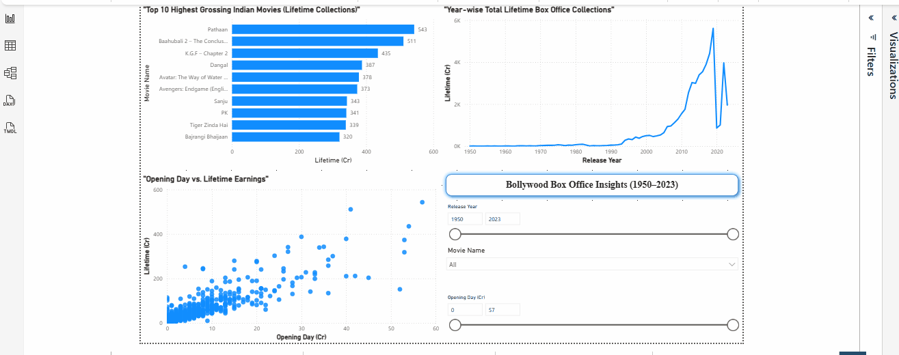

# 🎬 Bollywood Box Office Dashboard

A data visualization project analyzing the financial performance of Bollywood movies from 1950 onwards using **Tableau** and **Power BI**.

---

## 📊 Project Overview

This project explores trends and patterns in the Indian film industry using historical box office data. Visuals include top-grossing movies, year-wise earnings, and interactive filters for deep dives.

---

## 🧩 Tools Used

- **Power BI (.pbix)** – Interactive dashboard with slicers and visual storytelling  
- **Tableau (.twbx)** – Rich visual exploration and charting  
- **Excel/CSV** – Data cleaning and preparation

---

## 📈 Key Visualizations

### 🔹 Power BI Dashboard
- ✅ Top 10 Movies by Lifetime Earnings (Bar Chart)
- ✅ Year-wise Total Earnings (Line Chart)
- ✅ Opening Day vs Lifetime (Scatter Plot)
- ✅ Interactive Filters (Year, Movie)
- ✅ Clean single-page dashboard layout
- 

### 🔹 Tableau Dashboard
- ✅ Top Performers with Tooltip Details
- ✅ Yearly Trend Line
- ✅ Visual Story Points (sheets combined into dashboard)

---

## 📂 Files in This Repo

| File | Description |
|------|-------------|
| `movie_data.csv` | Raw box office dataset |
| `Bollywood_BoxOffice_PowerBI.pbix` | Power BI dashboard file |
| `Bollywood_BoxOffice_Tableau.twbx` | Tableau packaged workbook |

---

## 🧼 Data Cleaning Notes

- Removed "N.A." entries and replaced with nulls
- Converted currency fields (e.g., "0.75 Cr") into numeric format
- Standardized release years for grouping

---

## 📌 Learnings

- Building dashboards from scratch in Tableau and Power BI
- Storytelling with data using visuals and filters
- Hands-on with slicers, containers, and layout management

---

## 🧠 Future Enhancements

- Add Genre and Director metadata
- Integrate IMDb ratings
- Publish to Tableau Public / Power BI Service

---

## 📬 Contact

**Vishal Patil**  
📧 patilvishal591.vp90@gmail.com  
🔗 [LinkedIn]https://www.linkedin.com/in/vishal-patil-b3814715a/

> ⭐ If you like this project, consider giving it a star!

## 🙏 Feedback Welcome!

I'm still learning Tableau and Power BI.  
If you spot anything that can be improved or done better, I’d be **very grateful for your suggestions or feedback**!
